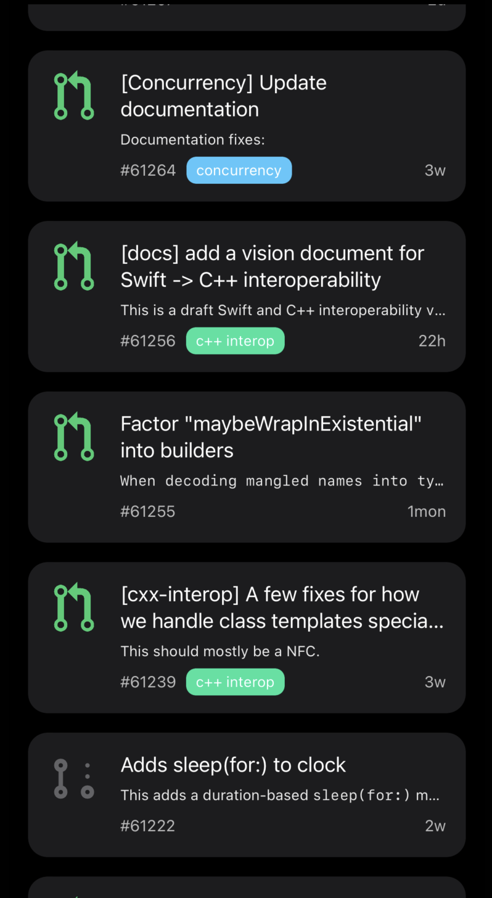
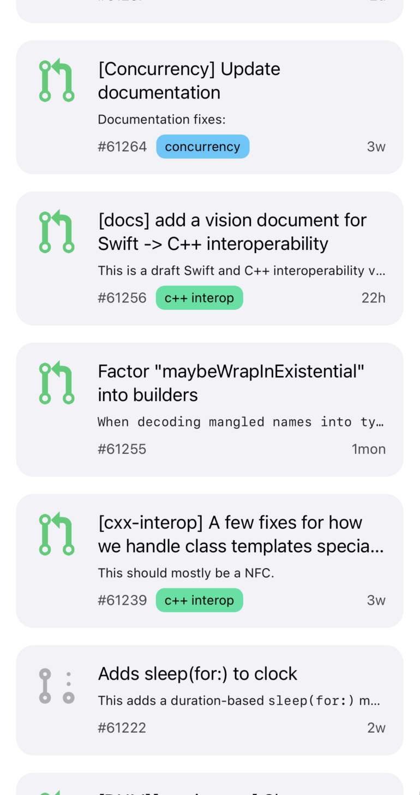
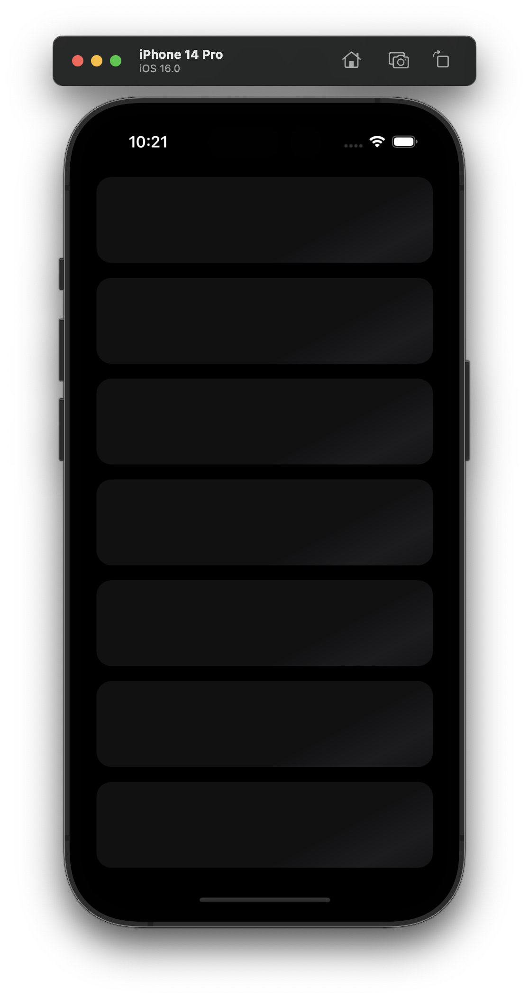

## Github pull request list

1. Have displayed list of prs from apple swift library
2. Followed MVVM architecture
3. Handled edge cases, empty state, loader state with Shimmer
4. Unit tests written for the View model for now
5. App supports dark/light mode
6. Resolve SPM dependencies to run the project

Please update the Github PAT string in `ListService.swift` 

Refer here for creating one: 
https://docs.github.com/en/authentication/keeping-your-account-and-data-secure/creating-a-personal-access-token

Screen shots added of the app in `Screenshots/**`

  
